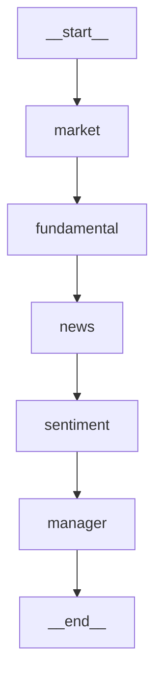

# Agents Runbook

> 對應檔案：`backend/app/agents/`、`backend/app/llm/`、`backend/app/workers/tasks/run_analysis.py`  
> 完成 Phase：P12（框架）、P13（Analyst 真實 prompt）、P14（美股 + Fallback Chain + Streaming）

## 1. 模組總覽

```
backend/app/agents/
├── __init__.py           # package
├── state.py              # AgentState TypedDict + reducer（add / merge_dict）
├── base_analyst.py       # BaseAnalyst ABC + ANALYST_REGISTRY
├── analysts/
│   ├── __init__.py       # side-effect: 載入 4 個 Analyst（觸發 register）
│   ├── market_analyst.py        # 技術面（TW+US）
│   ├── fundamental_analyst.py   # 基本面（TW+US）
│   ├── news_analyst.py          # 新聞/公告（TW+US）
│   └── sentiment_analyst.py     # 籌碼（TW only）
├── tools/__init__.py     # ToolRegistry（8 個 method，全部走 ta_agent_ro）
├── state_trim.py         # trim_debate_history + estimate_state_size
└── graph_builder.py      # build_graph + placeholder_manager

backend/app/llm/
├── __init__.py           # package + re-export
├── base_provider.py      # BaseLLMProvider + LLMResponse + Registry
└── gemini_provider.py    # GeminiProvider

backend/app/workers/tasks/
└── run_analysis.py       # Celery task: run_analysis(analysis_id)
```

## 2. 一鍵看 graph 結構

```bash
cd backend
uv run python -c "
from app.agents.graph_builder import build_graph
g = build_graph('2330', 'TWSE', debate_rounds=1)
print(g.get_graph().draw_mermaid())
"
```

輸出大致為：



## 3. 跑一次 stub analysis（不打 LLM）

```bash
cd backend
uv run python -c "
import asyncio
from app.agents.graph_builder import build_graph, build_initial_state
g = build_graph('2330', 'TWSE', analyst_types=['market'], debate_rounds=0)
state = build_initial_state(
    symbol='2330', market='TWSE',
    analysis_id='00000000-0000-0000-0000-000000000001',
    trace_id='dbg', analyst_types=['market'],
    llm_model='gemini-2.0-flash', debate_rounds=0,
)
final = asyncio.run(g.ainvoke(state))
print('signal=', final['signal'])
print('report_md=', final['report_md'][:200])
"
```

期待輸出含 `[stub]` 與 `action=HOLD`。

## 4. 透過 API 推 task

```bash
# 1. login
TOKEN=$(curl -s -X POST http://localhost:8000/api/v1/auth/login \
  -H "Content-Type: application/json" \
  -d "{\"email\":\"$ADMIN_EMAIL\",\"password\":\"$ADMIN_PWD\"}" \
  | jq -r '.data.access_token')

# 2. POST /analysis（必帶 Idempotency-Key + CSRF）
curl -X POST http://localhost:8000/api/v1/analysis \
  -H "Authorization: Bearer $TOKEN" \
  -H "Idempotency-Key: $(uuidgen)" \
  -H "X-CSRF-Token: $CSRF_TOKEN" \
  -H "Content-Type: application/json" \
  -d '{"symbol":"2330","analyst_types":["market"],"llm_model":"gemini-2.0-flash","debate_rounds":1}'

# 3. 查 status
curl -H "Authorization: Bearer $TOKEN" \
  http://localhost:8000/api/v1/analysis/<analysis_id>
```

## 5. 安全：Tool 為何用 `ta_agent_ro`

防 prompt injection 注入 INSERT/UPDATE/DELETE：

- ta_agent_ro 在 DB 層級只授 SELECT 權限。
- 若 LLM 被誘使叫 tool 做 `INSERT INTO ...`，會被 PG 直接 reject `permission denied`。
- 千萬不要把 `ta_service_rw` sessionmaker 傳給 `ToolRegistry`。

## 6. State trim 觸發條件

```python
from app.agents.state_trim import estimate_state_size, MAX_STATE_SIZE_BYTES, trim_debate_history
size = estimate_state_size(state)
if size > MAX_STATE_SIZE_BYTES or len(state['debate_history']) > 6:
    state = await trim_debate_history(state, llm=my_llm)
```

trim 後：`[{role: 'summary', content: <摘要>}] + 最近 6 筆`。

## 7. LLM Provider 切換

```python
from app.llm import get_llm_provider
from app.core.config import settings

llm = get_llm_provider('google', settings)  # GeminiProvider
# P14 起：
# llm = get_llm_provider('openai', settings)
# llm = get_llm_provider('anthropic', settings)
```

P12 只實作 `google`；P14 補 OpenAI / Anthropic + `FallbackChain`。

## 8. 常見問題

### Q1：跑 graph 時 `langgraph` 沒裝
- A：`cd backend && uv sync`。`pyproject.toml` 已 pin `langgraph>=0.2.50,<0.3`。

### Q2：`gemini` API 呼叫 401 / quota exceeded
- A：檢查 `.env` 的 `GOOGLE_API_KEY`；P14 之後會 fallback 到 openai/anthropic。

### Q3：task `run_analysis` status 卡 `running`
- A：原因可能是 graph 內部 hang 或 worker 被 kill。
  - 短期：手動 `UPDATE analysis_reports SET status='failed' WHERE id=...`。
  - 長期：`cleanup_orphans` daily 04:00 兜底（PLAN 15.4）。

### Q4：怎麼確認 Analyst 都註冊到了
```bash
cd backend && uv run python -c "
from app.agents.analysts import *  # noqa: F401,F403
from app.agents.base_analyst import ANALYST_REGISTRY
print(sorted(ANALYST_REGISTRY.keys()))
"
```
應印出 `['fundamental', 'market', 'news', 'sentiment']`。

### Q5：cost 為何顯示 0
- A：`calc_cost()` 未知 model id → 0 + warning。請更新 `gemini_provider.py:pricing` 或檢查 `model` 參數是否拼錯。

## 9. 下一步（P13 / P14）

- P13：把 4 個 Analyst stub 替換為真實 prompt + Tool call；加 Bull/Bear/Manager Researcher。
- P14：美股 Analyst（共用 class）+ LLM Fallback Chain + WS streaming + LLM 月配額。
